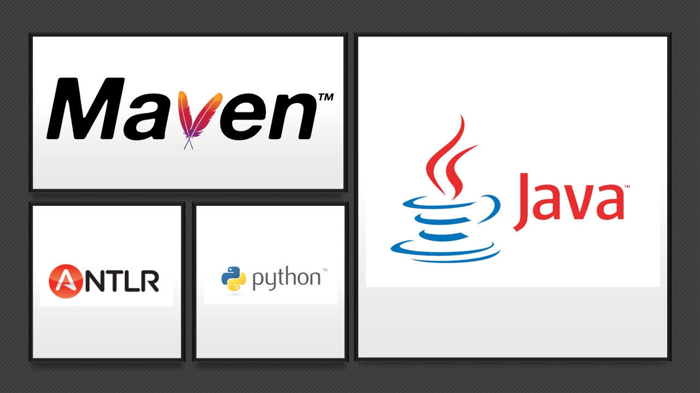

##   Dsl-groupe-B

* Auteurs: **Team B**
  ### *Gestion du Kernel + scenarios python*
  > * DJEKINOU Paul-Marie
  > * KOFFI Paul
    ### *DSL Antlr + extensions*
  >  * AINADOU Florian
  > * NABAGOU Djotiham
* Version actuelle : __Basic scenarios__ + __Support for customized animated texts__ + __Support for audio__

##   Pré-requis
 <kbd>__MoviePy__</kbd> : Pour l'installation, c'est par 👉 [ici](https://github.com/Zulko/moviepy)

 <kbd>__ImageMagick__</kbd> : Pour l'installation, c'est par 👉 [ici](https://www.imagemagick.org/script/index.php)

 <kbd>__Visual Studio Code__</kbd> : Pour l'installation, c'est par 👉 [ici](https://code.visualstudio.com/)

 <kbd>__JAVA , MAVEN, PYTHON__</kbd>


##   Démo rapide de nos fonctionnalités
* `Scenario1` : &nbsp;&nbsp;&nbsp;&nbsp;&nbsp;&nbsp;&nbsp;&nbsp;&nbsp;&nbsp;&nbsp;&nbsp;&nbsp;&nbsp;&nbsp;&nbsp;&nbsp;&nbsp;&nbsp;&nbsp;&nbsp;&nbsp;&nbsp;&nbsp;&nbsp;&nbsp;&nbsp;&nbsp;&nbsp;&nbsp;&nbsp;&nbsp;&nbsp;&nbsp;&nbsp;&nbsp;&nbsp;&nbsp;&nbsp;&nbsp;&nbsp;&nbsp;&nbsp;&nbsp;&nbsp;&nbsp;&nbsp;&nbsp;&nbsp;&nbsp;&nbsp;&nbsp;&nbsp;&nbsp;&nbsp;&nbsp;&nbsp;&nbsp;&nbsp;&nbsp;&nbsp;&nbsp;&nbsp;&nbsp;&nbsp;&nbsp;&nbsp;&nbsp;&nbsp;&nbsp;&nbsp;&nbsp;&nbsp;&nbsp;&nbsp;&nbsp;&nbsp;&nbsp;&nbsp;&nbsp;&nbsp;&nbsp;&nbsp;&nbsp;&nbsp;&nbsp;&nbsp;&nbsp;&nbsp;&nbsp;&nbsp;&nbsp;&nbsp; 👉 [ici](https://drive.google.com/file/d/19RyqV8oVMZ8SNIQ71oXbLt3mdt5Y3ou1/view?usp=sharing)
* `Scenario2` :  &nbsp;&nbsp;&nbsp;&nbsp;&nbsp;&nbsp;&nbsp;&nbsp;&nbsp;&nbsp;&nbsp;&nbsp;&nbsp;&nbsp;&nbsp;&nbsp;&nbsp;&nbsp;&nbsp;&nbsp;&nbsp;&nbsp;&nbsp;&nbsp;&nbsp;&nbsp;&nbsp;&nbsp;&nbsp;&nbsp;&nbsp;&nbsp;&nbsp;&nbsp;&nbsp;&nbsp;&nbsp;&nbsp;&nbsp;&nbsp;&nbsp;&nbsp;&nbsp;&nbsp;&nbsp;&nbsp;&nbsp;&nbsp;&nbsp;&nbsp;&nbsp;&nbsp;&nbsp;&nbsp;&nbsp;&nbsp;&nbsp;&nbsp;&nbsp;&nbsp;&nbsp;&nbsp;&nbsp;&nbsp;&nbsp;&nbsp;&nbsp;&nbsp;&nbsp;&nbsp;&nbsp;&nbsp;&nbsp;&nbsp;&nbsp;&nbsp;&nbsp;&nbsp;&nbsp;&nbsp;&nbsp;&nbsp;&nbsp;&nbsp;&nbsp;&nbsp;&nbsp;&nbsp;&nbsp;&nbsp;&nbsp;&nbsp;&nbsp;&nbsp;👉 [ici](https://drive.google.com/file/d/1m-97sSkBXMuvHhR0sY43K60d9z-EbGZW/view?usp=sharing)
* `Support for audio` : &nbsp;&nbsp;&nbsp;&nbsp;&nbsp;&nbsp;&nbsp;&nbsp;&nbsp;&nbsp;&nbsp;&nbsp;&nbsp;&nbsp;&nbsp;&nbsp;&nbsp;&nbsp;&nbsp;&nbsp;&nbsp;&nbsp;&nbsp;&nbsp;&nbsp;&nbsp;&nbsp;&nbsp;&nbsp;&nbsp;&nbsp;&nbsp;&nbsp;&nbsp;&nbsp;&nbsp;&nbsp;&nbsp;&nbsp;&nbsp;&nbsp;&nbsp;&nbsp;&nbsp;&nbsp;&nbsp;&nbsp;&nbsp;&nbsp;&nbsp;&nbsp;&nbsp;&nbsp;&nbsp;&nbsp;&nbsp;&nbsp;&nbsp;&nbsp;&nbsp;&nbsp;&nbsp;&nbsp;&nbsp;&nbsp;&nbsp;&nbsp;&nbsp;&nbsp;&nbsp;&nbsp;&nbsp;&nbsp;&nbsp;&nbsp;&nbsp;&nbsp;&nbsp;&nbsp;&nbsp;👉 [ici](https://drive.google.com/file/d/1XQG8X36FR4e23ONn1-RCl5AVm3z95tvY/view?usp=sharing)
* `Support for customized animated texts` : &nbsp;&nbsp;&nbsp;&nbsp;&nbsp;&nbsp;&nbsp;&nbsp;&nbsp;&nbsp;&nbsp;&nbsp;&nbsp;&nbsp;&nbsp;&nbsp;&nbsp;&nbsp;&nbsp;&nbsp;&nbsp;&nbsp;&nbsp;&nbsp;&nbsp;&nbsp;&nbsp;&nbsp;&nbsp;&nbsp;&nbsp;&nbsp;&nbsp;&nbsp;👉 [ici](https://drive.google.com/file/d/1Gk-Z64GswuqCTPo54cjSjKeaVHRz1ffB/view?usp=sharing)

Les éléments relatifs à la génération de la vidéo de démo se trouve dans le dossier <kbd>__scripts/videoDSL__</kbd> :  👉 [ici](https://github.com/wak-nda/dsl-group-b-TP2/tree/main/scripts/videoDSL)
###  La video finale demo est un rassemblement de 6 parties distinctes , elle se trouve : 👉 [ici](https://github.com/wak-nda/dsl-group-b-TP2/blob/main/scripts/videoDSL/outputs/demo.mp4)
> * Part1.mp4 généré à partir du fichier ( [introduction_animation.cin](https://github.com/wak-nda/dsl-group-b-TP2/blob/main/scripts/videoDSL/introduction_animation.cin) ) 
> * Part2.mp4 généré à partir du fichier ( [introduction_decoupage.cin](https://github.com/wak-nda/dsl-group-b-TP2/blob/main/scripts/videoDSL/introduction_decoupage.cin) )
> * Part3.mp4 généré à partir du fichier ( [decoupage_subtitle.cin](https://github.com/wak-nda/dsl-group-b-TP2/blob/main/scripts/videoDSL/decoupage_subtitle.cin) )
> * Part4.mp4 généré à partir du fichier ( [introduction_extension.cin](https://github.com/wak-nda/dsl-group-b-TP2/blob/main/scripts/videoDSL/introduction_extension.cin) )
> * Part5.mp4 généré à partir du fichier ( [extension_presentation.cin](https://github.com/wak-nda/dsl-group-b-TP2/blob/main/scripts/videoDSL/extension_presentation.cin) )
> * Part6.mp4 généré à partir du fichier ( [credits.cin](https://github.com/wak-nda/dsl-group-b-TP2/blob/main/scripts/videoDSL/credits.cin) )
> * Demo.mp4 généré à partir du fichier ( [final_assemblage.cin](https://github.com/wak-nda/dsl-group-b-TP2/blob/main/scripts/videoDSL/final_assemblage.cin) )

Le temps de traitement des différentes parties étant assez conséquent, on a préféré séparer la vidéo en plusieurs scripts qui peuvent
être exécutés en simultanée ce qui nous permet d'avoir plus rapidement toutes les parties pour ensuite procéder à la réunion de toutes 
ces parties ensuite.

##   Comment utiliser ce repository

* La branche `main` (la branche par défaut) représente la dernière version stable du système.
* La branche `develop` représente la branche de developpement du DSL. 
* La branche `scenarios` c'est sur cette branche qu'on a développer les scénarios en python que l'on devait générer depuis notre DSL.

##   Récupération du projet

Effectuer un clone classique du projet en faisant ```git clone https://github.com/wak-nda/dsl-group-b-TP2.git``` ou en récupérant le zip depuis cette page.

##   Compilation
Lancez à la racine du projet le script <kbd>__prepare.sh__</kbd> 👉 [ici](https://github.com/wak-nda/dsl-group-b-TP2/blob/main/prepare.sh)


##  Générer une vidéo à partir du DSL

Tout est expliqué ici 👉 [ici](https://github.com/wak-nda/dsl-group-b-TP2/blob/main/scripts/videoDSL/outputs/part5.mp4)

La vidéo générée se trouvera dans le dossier `scripts/ouputs` 

Vous devez également placer toutes les vidéos et les pistes audio utilisé par vos scripts dans ce dossier. (`scripts/ouputs`)

Dans le cas d'un nouveau script, placez le fichier dans le dossier `scripts`, puis suivez les étapes dans la vidéo.


##  Utiliser le DSL

### Syntaxe
La syntaxe du DSL est la suivante :

* #### Déclaration d'un TextClip :  
<kbd>`@name` =  textClip with text `@text` during `@time | XX:XX` s [with animation `arrive | cascade | vortex | vortexout | scroll`] </kbd>

* #### Chargement d'une Vidéo : <kbd>`@name` = video `@fileName`</kbd>

* #### Decoupage d'une Vidéo : <kbd>`@name` = `@videoName` from `XX:XX` to `ZZ:ZZ`</kbd>

* #### Déclaration d'un Sous-titre :  
<kbd>`@name` =  subtitle with text `@text` starting at `@time | XX:XX` s  `afterBeginning | beforeBeginning | afterEnding | beforeEnding`  of `@subtitle | @textClip | @video`  during `@time | XX:XX` s </kbd>

* #### Déclaration d'un Audio général   : <kbd>`@name` = audio `@fileName` starting at `@time | XX:XX` s  volume `[0.1-2.0]f` </kbd>

* #### Déclaration d'un Audio relatif :
<kbd>`@name` =  audio `@fileName` starting at `@time | XX:XX` s  `afterBeginning | beforeBeginning | afterEnding | beforeEnding`  of `@subtitle | @textClip | @video` volume `[0.1-2.0]f`</kbd>

* #### Déclaration de la séquence finale de la vidéo : <kbd>createVideo with  (`@video | @textClip` * n)</kbd>

* #### Nom de la vidéo après montage  : <kbd>videoTitle is `@name`</kbd>


##   Pile Technologique
  <p align="center">
    
  </p>